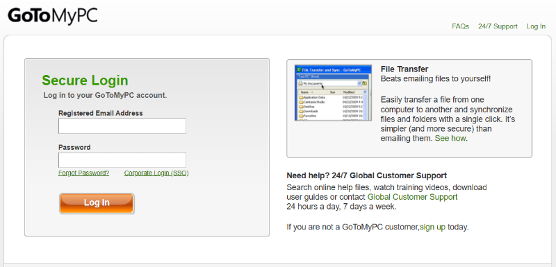

# Accessing your GoToMyPC Virtual Machine

!!! info "You will need the **Email Address**, **Password**, and **Access Code** provided by your trainer to complete these steps."

## Step 1: Sign in to GoToMyPC

1. Open a browser and go to [gotomypc.com](https://www.gotomypc.com/)

2. Enter the **Email Address** and **Password** provided by your trainer and click **Sign In**.

    !!! quote ""
        

## Step 2: Enter the Access Code

1. When prompted, enter the **Access Code** provided by your trainer and click **Connect**.

    <!-- screenshot needed: img/gotomypc-access-code.png -->

## Step 3: Connect to your virtual machine

You should now see a Windows desktop similar to this:

!!! quote ""
    

## Step 4: Customise your GoToMyPC window

Before you start working, change two settings in GoToMyPC to avoid interruptions during the session.

### Turn off Dim Viewer

1. In the menu bar at the top of the window, click **Tools** then **Preferences**.

2. On the **Viewer** tab, uncheck **Dim Viewer when inactive**.

    <!-- screenshot needed: img/gotomypc-dim-viewer.png -->

### Increase the session timeout

1. In the menu bar at the top of the window, click **Tools** then **Preferences**.

2. On the **Security** tab, change the **Viewer Security Time-Out** to more than **300** minutes.

    !!! tip "Click the checkbox next to the number field to enable editing, then increase the value."

    !!! quote ""
        

---

!!! success "You are now set up and ready to go. Let your trainer know in the WebEx chat that you are all set up with GoToMyPC."
