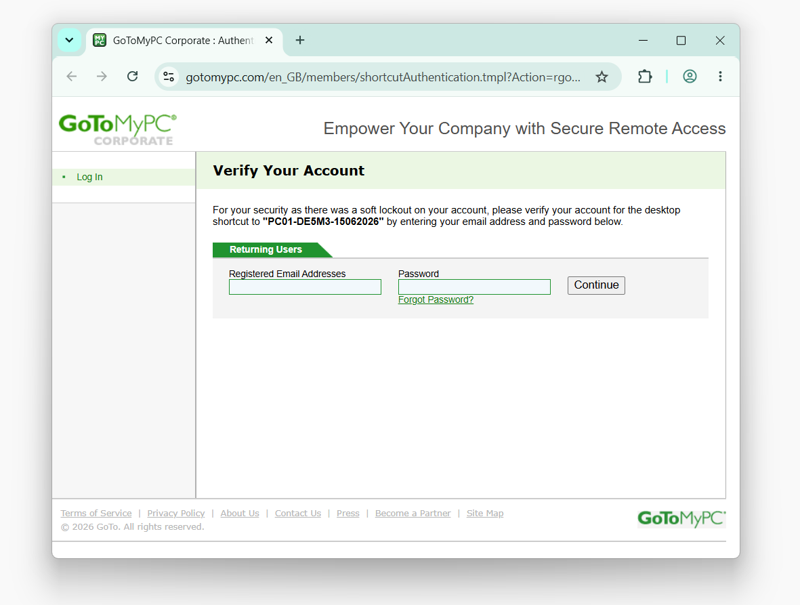
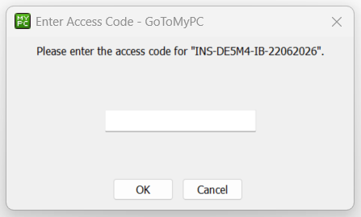
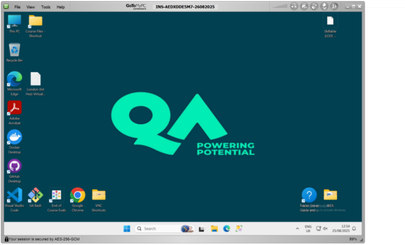
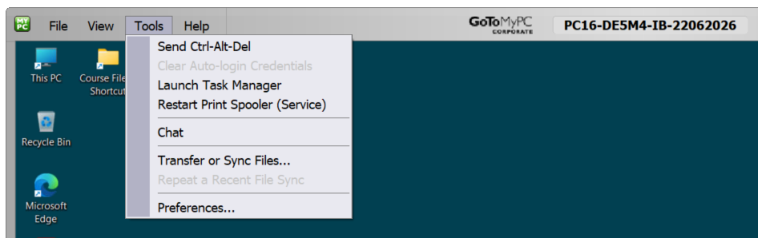
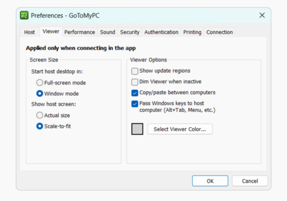
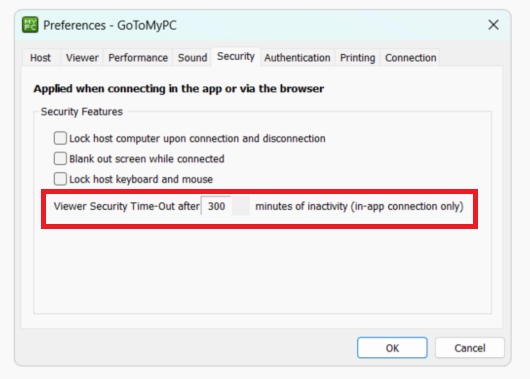

# Accessing your GoToMyPC Virtual Machine

!!! info "You will need the **Email Address**, **Password**, and **Access Code** provided by your trainer to complete these steps."

!!! warning "If you enter an incorrect password 3 times, the account will be locked out for 5 mins!"
    - It is important that a reconnect **is not attempted** during this period otherwise the time out will be extended.
    - The account will always reset after that 5 min period with the same credentials.
    - **Do not** attempt to change the password and **do not** click the "forgot password" link.

## Step 1: Sign in to GoToMyPC

1. Open the GoToMyPC link from your setup page.

2. Enter the **Email Address** and **Password** provided by your trainer and click **Sign In**.

    !!! quote ""
        

??? note "Seeing a different screen? Sign in with the same credentials."
    Some learners are taken to the main GoToMyPC login page instead. Sign in with the same credentials.

    !!! quote ""
        

## Step 2: Enter the Access Code

1. When prompted, enter the **Access Code** provided by your trainer and click **Connect**.

    !!! quote ""
        

## Step 3: Connect to your virtual machine

You should now see a Windows desktop similar to this:

!!! quote ""
    

## Step 4: Customise your GoToMyPC Virtual Machine (VM)

### Close all windows

You can close all open windows that may be left over from the VM setup

### Turn off Dim Viewer

Before you start working, change two settings in GoToMyPC to avoid interruptions during the session.

!!! tip "If you can't see the menu bar, then move your cursor to the top of your screen."

In the menu bar at the top of the window, click **Tools** then **Preferences**.

!!! quote ""
    

1. On the **Viewer** tab, uncheck **Dim Viewer when inactive**.

    !!! quote ""
        

### Increase the session timeout

1. In the menu bar at the top of the window, click **Tools** then **Preferences**.

2. On the **Security** tab, change the **Viewer Security Time-Out** to more than **300** minutes.

    !!! tip "Click the checkbox next to the number field to enable editing, then increase the value."

    !!! quote ""
        

### Change the Display Settings

If you want you can increase the i**DisplaySettings > Scale** ~ to something bigger than 100%

You can also change the **Display resolution** to match your monitor

---

!!! success "You are now set up and ready to go. Let your trainer know in the chat that you are all set up with GoToMyPC."
