# Accessing Learn On Demand (LOD)

!!! note "Note: You will need a QA Learn On Demand account and an LOD key from your trainer to complete these steps."

## Step 1: Go to the QA LOD website

1. Open a browser and navigate to: [qa.learnondemand.net](https://qa.learnondemand.net/)

    !!! quote ""
        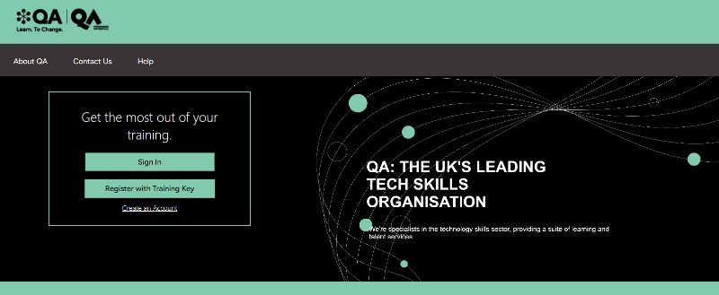

## Step 2: Sign in to LOD

!!! info "If you do not have a QA LOD account yet, you need to create one first."
    1. Click **Create an Account**
    2. Enter your details using your **work email address**
    3. Click **Save**

    !!! quote ""
        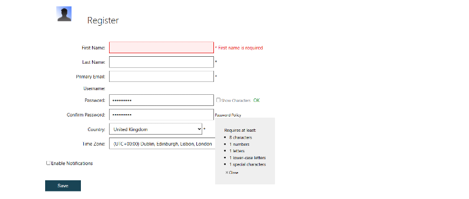

1. Enter your **Username** and **Password** and click **Sign in**.

    !!! quote ""
        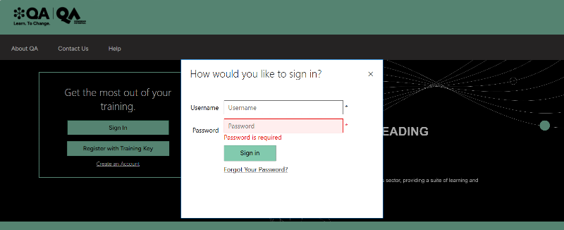

## Step 3: Check your dashboard

You should see your Learn On Demand dashboard:

!!! quote ""
    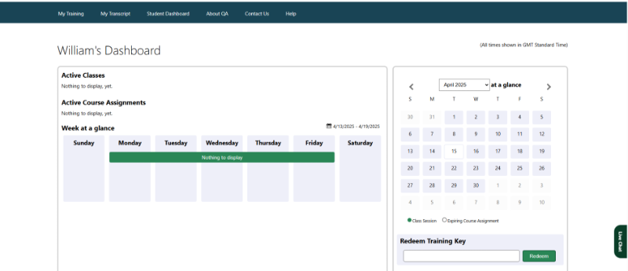

## Step 4: Redeem your LOD key

!!! warning "You will need a LOD key from your trainer to complete this step."

1. Copy and paste your LOD key (provided by your trainer) into the **Redeem Training Key** box.

2. Click **Redeem**.

    !!! quote ""
        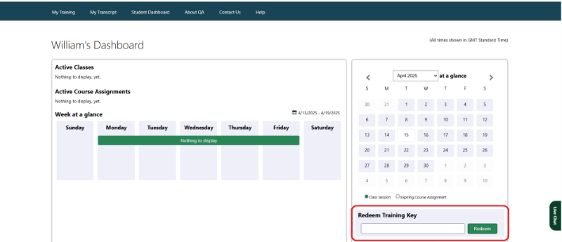

## Step 5: Launch the VM

A course for this week should now appear on your dashboard.

1. Click the course for this week.

2. Click the **Launch** button.

    !!! quote ""
        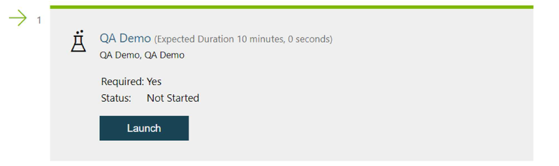

## Step 6: Wait for the VM to build

Your LOD lab is now being built. This may take a minute or two ...

!!! quote ""
    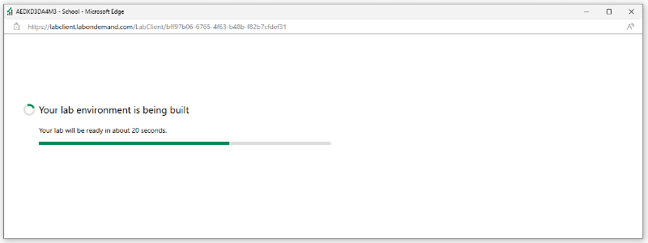

!!! success "When the build is complete, you should see a Windows desktop similar to this:"

!!! quote ""
    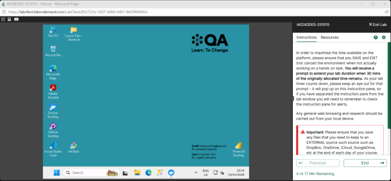

## Step 7: Customise your VM

The LOD interface includes an instructions pane on the right -x- you can remove it to give yourself more screen space.

1. Click the **Computer icon** in the top-left toolbar.

2. Click **Split Windows** - the instructions pane can now be minimised.

    !!! quote ""
        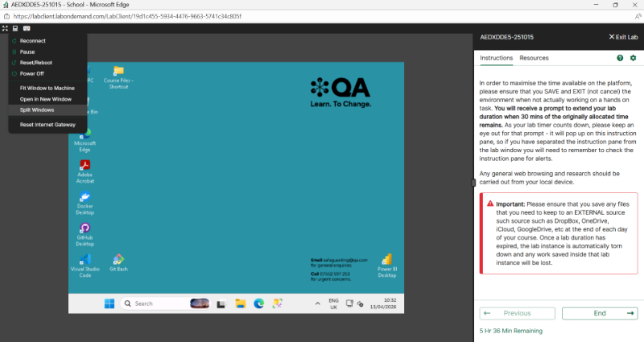

3. To make the VM fill your screen, click **Full Screen** in the top-left toolbar, or maximise the browser window - the VM will scale to fit.

    !!! quote ""
        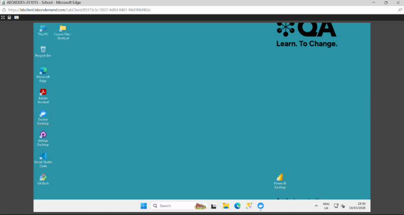

!!! tip "To paste text into the VM, use the **Keyboard icon** in the top-left toolbar."

!!! quote ""
    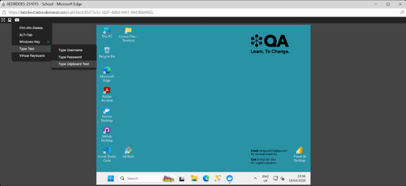

---

!!! success "You are now set up with Learn on Demand!"

!!! info "Let your trainer know in the WebEx chat that you are ready to go."

